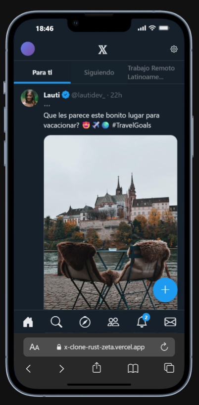

# Clon de Twitter (X)

## Descripción
Este proyecto es un clon de la interfaz de usuario de Twitter (ahora conocido como X), desarrollado con HTML, CSS y JavaScript. Su objetivo es replicar la experiencia de usuario de la popular plataforma de microblogging, incluyendo un feed dinámico de tweets, interacciones básicas y una navegación intuitiva.

## Tecnologías Utilizadas
*   HTML5: Para la estructura del contenido.
*   CSS3: Para el diseño y la estilización de la interfaz.
*   JavaScript (ES6+): Para la interactividad y el manejo dinámico del contenido.
*   Bootstrap Icons: Para los íconos de la interfaz.

## Características
*   **Splash Screen**: Pantalla de carga inicial para una experiencia de usuario fluida.
*   **Feed Dinámico de Tweets**: Renderizado de tweets a partir de una base de datos simulada.
*   **Interacciones de Tweets**: Funcionalidad de "Me gusta" con actualización visual.
*   **Navegación Intuitiva**: Pestañas de navegación superior y barra de navegación inferior.
*   **Botón Flotante para Componer**: Botón de acción rápida que se oculta al hacer scroll.
*   **Scroll Infinito**: Carga automática de más tweets al llegar al final del feed.
*   **Diseño Responsivo**: Adaptable a diferentes tamaños de pantalla.

## Instalación y Uso
Para ejecutar este proyecto localmente, sigue estos pasos:
1.  Clona el repositorio: `git clone <URL_DEL_REPOSITORIO>`
2.  Navega al directorio del proyecto: `cd varios-clones`
3.  Abre el archivo `index.html` en tu navegador web preferido.

## Créditos/Autor
Desarrollado por [Carlos Namias]

## 📸 Vistas Previas

| Pantalla  | Inicio | Descubrir |
| :---: | :---: | :---: |
|  |  |  |
